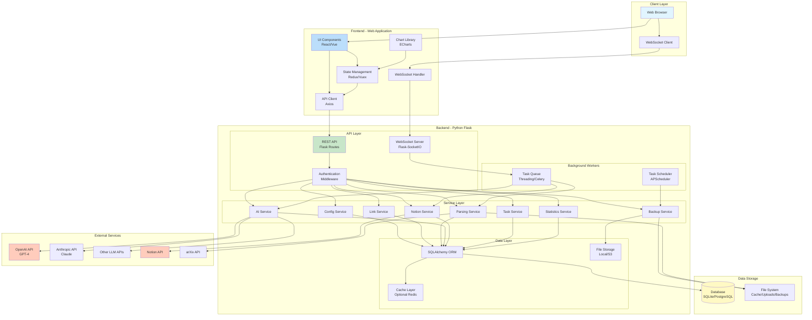
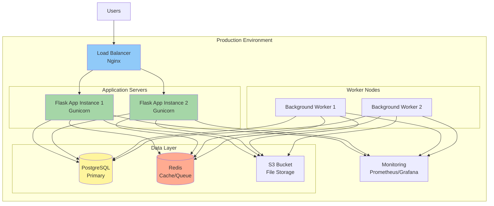
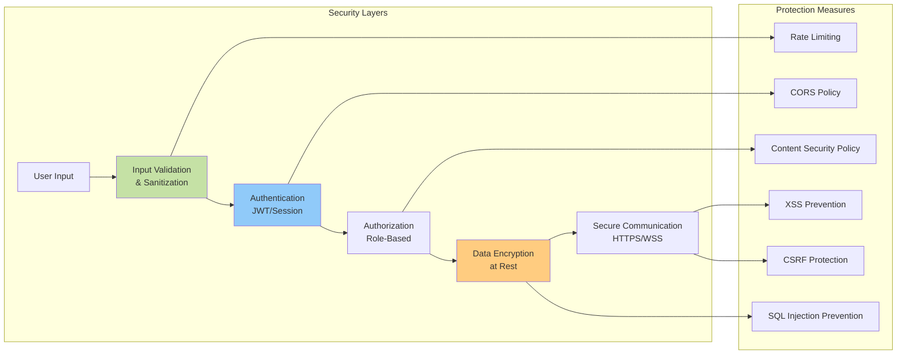
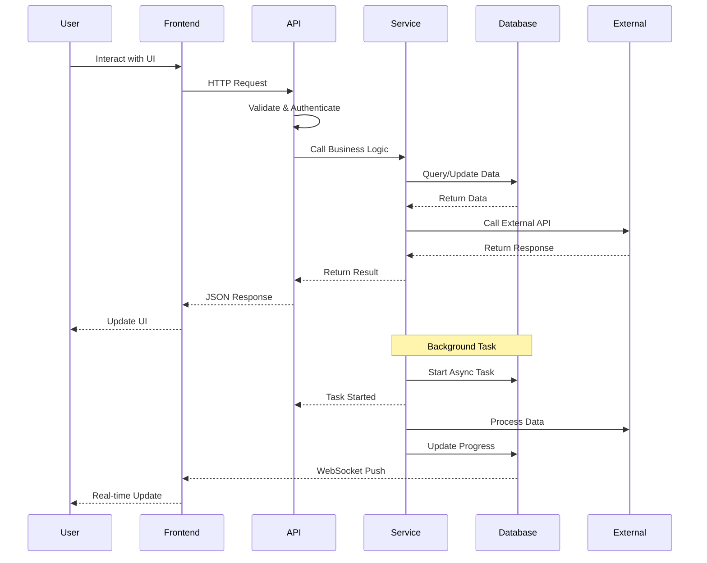
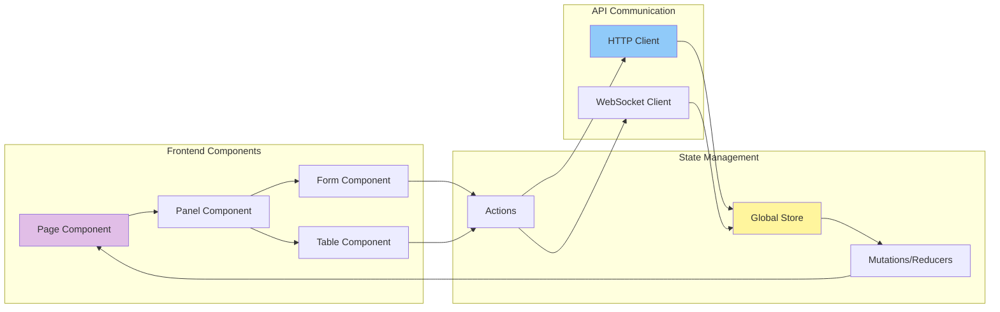

# System Architecture Diagram

## Overall System Architecture

## Technology Stack Details

### Frontend Stack
- **Framework**: React (v18+) or Vue 3
- **State Management**: Redux Toolkit / Pinia
- **HTTP Client**: Axios
- **WebSocket**: Socket.IO Client
- **Charts**: Apache ECharts
- **UI Components**: Material-UI / Ant Design / Custom
- **Build Tool**: Vite / Webpack
- **Styling**: CSS Modules / Styled Components / Tailwind CSS

### Backend Stack
- **Framework**: Flask 3.0
- **ORM**: SQLAlchemy 2.0
- **Database**: SQLite (dev) / PostgreSQL (prod)
- **WebSocket**: Flask-SocketIO
- **Task Queue**: Python Threading / Celery (optional)
- **Scheduler**: APScheduler
- **Encryption**: cryptography (Fernet)
- **HTTP Client**: requests
- **Parsing**: BeautifulSoup4, PyPDF2, pdfplumber
- **OCR**: pytesseract
- **API Clients**:
  - notion-client (Notion)
  - openai (OpenAI)
  - anthropic (Claude)
  - arxiv (arXiv)

### Infrastructure
- **Web Server**: Nginx (reverse proxy)
- **WSGI Server**: Gunicorn
- **Process Manager**: Supervisor / systemd
- **Containerization**: Docker + Docker Compose
- **Cache**: Redis (optional)
- **Storage**: Local filesystem / AWS S3 (optional)

## Deployment Architecture

## Security Architecture

## Data Flow Overview

## Component Communication

