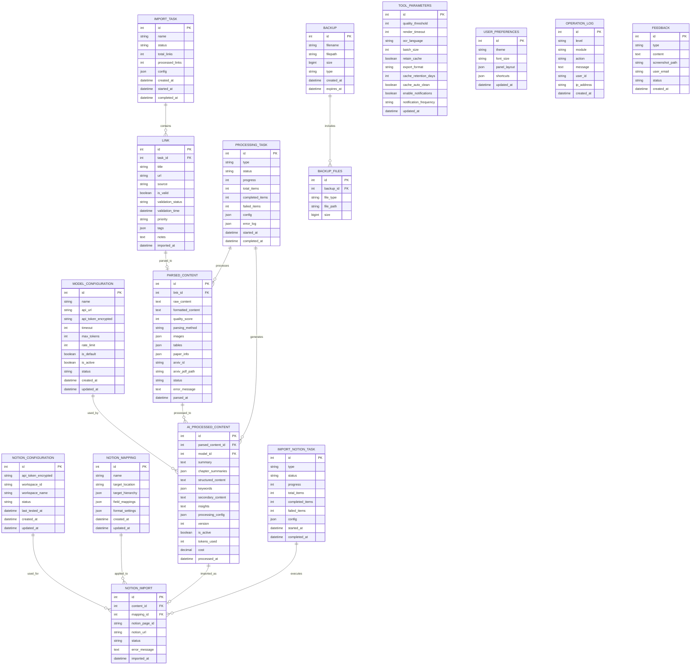

# Database Schema (ERD)

## Entity Relationship Diagram



## Table Details

### Configuration Tables

#### 1. model_configuration
Stores AI model configurations with encrypted credentials.

| Column | Type | Description |
|--------|------|-------------|
| id | INTEGER | Primary key |
| name | VARCHAR(100) | Model name (e.g., "GPT-4", "Claude 3") |
| api_url | VARCHAR(500) | API endpoint URL |
| api_token_encrypted | TEXT | Encrypted API token/key |
| timeout | INTEGER | Request timeout in seconds (default: 30) |
| max_tokens | INTEGER | Maximum tokens per request |
| rate_limit | INTEGER | API calls per minute limit |
| is_default | BOOLEAN | Whether this is the default model |
| is_active | BOOLEAN | Whether model is active |
| status | VARCHAR(50) | Connection status (online/offline/error) |
| created_at | TIMESTAMP | Creation timestamp |
| updated_at | TIMESTAMP | Last update timestamp |

**Indexes:**
- PRIMARY KEY (id)
- INDEX (is_default, is_active)

#### 2. notion_configuration
Stores Notion API configuration.

| Column | Type | Description |
|--------|------|-------------|
| id | INTEGER | Primary key |
| api_token_encrypted | TEXT | Encrypted Notion API token |
| workspace_id | VARCHAR(100) | Notion workspace ID |
| workspace_name | VARCHAR(200) | Workspace display name |
| status | VARCHAR(50) | Connection status |
| last_tested_at | TIMESTAMP | Last connection test time |
| created_at | TIMESTAMP | Creation timestamp |
| updated_at | TIMESTAMP | Last update timestamp |

**Indexes:**
- PRIMARY KEY (id)

#### 3. tool_parameters
Global tool configuration parameters.

| Column | Type | Description |
|--------|------|-------------|
| id | INTEGER | Primary key (singleton, always id=1) |
| quality_threshold | INTEGER | Parsing quality threshold (0-100) |
| render_timeout | INTEGER | Web page render timeout (seconds) |
| ocr_language | VARCHAR(20) | OCR language (en/zh/auto) |
| batch_size | INTEGER | Import batch size |
| retain_cache | BOOLEAN | Whether to retain local cache |
| export_format | VARCHAR(20) | Default export format (excel/pdf) |
| cache_retention_days | INTEGER | Cache retention period (days) |
| cache_auto_clean | BOOLEAN | Auto-clean cache |
| enable_notifications | BOOLEAN | Enable notifications |
| notification_frequency | VARCHAR(20) | Notification frequency |
| updated_at | TIMESTAMP | Last update timestamp |

#### 4. user_preferences
User interface preferences.

| Column | Type | Description |
|--------|------|-------------|
| id | INTEGER | Primary key (singleton, always id=1) |
| theme | VARCHAR(20) | UI theme (light/dark/system) |
| font_size | VARCHAR(20) | Font size (small/medium/large) |
| panel_layout | JSON | Hidden panel configuration |
| shortcuts | JSON | Custom keyboard shortcuts |
| updated_at | TIMESTAMP | Last update timestamp |

---

### Link Management Tables

#### 5. import_task
Import task records.

| Column | Type | Description |
|--------|------|-------------|
| id | INTEGER | Primary key |
| name | VARCHAR(200) | Task name |
| status | VARCHAR(50) | Task status (pending/running/completed/failed) |
| total_links | INTEGER | Total number of links |
| processed_links | INTEGER | Number of processed links |
| config | JSON | Task configuration (scope, parameters) |
| created_at | TIMESTAMP | Creation timestamp |
| started_at | TIMESTAMP | Start timestamp |
| completed_at | TIMESTAMP | Completion timestamp |

**Indexes:**
- PRIMARY KEY (id)
- INDEX (status, created_at)

#### 6. link
Imported links with metadata.

| Column | Type | Description |
|--------|------|-------------|
| id | INTEGER | Primary key |
| task_id | INTEGER | Foreign key to import_task |
| title | VARCHAR(500) | Link title |
| url | TEXT | Full URL |
| source | VARCHAR(50) | Source type (favorites/manual/history) |
| is_valid | BOOLEAN | Whether URL is valid |
| validation_status | VARCHAR(50) | Validation result (200/404/500/timeout) |
| validation_time | TIMESTAMP | Validation timestamp |
| priority | VARCHAR(20) | Priority level (high/medium/low) |
| tags | JSON | Array of tags |
| notes | TEXT | User notes |
| imported_at | TIMESTAMP | Import timestamp |

**Indexes:**
- PRIMARY KEY (id)
- FOREIGN KEY (task_id) REFERENCES import_task(id)
- INDEX (url(255)) - For deduplication
- INDEX (is_valid, status)

---

### Content Processing Tables

#### 7. parsed_content
Parsed content from links.

| Column | Type | Description |
|--------|------|-------------|
| id | INTEGER | Primary key |
| link_id | INTEGER | Foreign key to link |
| raw_content | TEXT | Raw extracted content |
| formatted_content | TEXT | Cleaned and formatted content |
| quality_score | INTEGER | Parsing quality score (0-100) |
| parsing_method | VARCHAR(50) | Method used (html/pdf/ocr) |
| images | JSON | Array of extracted images |
| tables | JSON | Array of extracted tables |
| paper_info | JSON | Extracted paper metadata |
| arxiv_id | VARCHAR(50) | arXiv paper ID |
| arxiv_pdf_path | VARCHAR(500) | Local path to downloaded PDF |
| status | VARCHAR(50) | Parsing status |
| error_message | TEXT | Error details if failed |
| parsed_at | TIMESTAMP | Parsing timestamp |

**Indexes:**
- PRIMARY KEY (id)
- FOREIGN KEY (link_id) REFERENCES link(id)
- INDEX (status, quality_score)
- INDEX (arxiv_id)

#### 8. ai_processed_content
AI-processed content with versions.

| Column | Type | Description |
|--------|------|-------------|
| id | INTEGER | Primary key |
| parsed_content_id | INTEGER | Foreign key to parsed_content |
| model_id | INTEGER | Foreign key to model_configuration |
| summary | TEXT | Overall summary |
| chapter_summaries | JSON | Chapter-by-chapter summaries |
| structured_content | TEXT | Restructured content |
| keywords | JSON | Extracted keywords and tags |
| secondary_content | TEXT | Secondary creation content |
| insights | TEXT | Generated insights |
| processing_config | JSON | Processing parameters used |
| version | INTEGER | Content version number |
| is_active | BOOLEAN | Whether this is the active version |
| tokens_used | INTEGER | Total tokens consumed |
| cost | DECIMAL(10,4) | Estimated cost |
| processed_at | TIMESTAMP | Processing timestamp |

**Indexes:**
- PRIMARY KEY (id)
- FOREIGN KEY (parsed_content_id) REFERENCES parsed_content(id)
- FOREIGN KEY (model_id) REFERENCES model_configuration(id)
- INDEX (parsed_content_id, version)
- INDEX (is_active)

#### 9. processing_task
Background processing task records.

| Column | Type | Description |
|--------|------|-------------|
| id | INTEGER | Primary key |
| type | VARCHAR(50) | Task type (parsing/ai_processing) |
| status | VARCHAR(50) | Task status |
| progress | INTEGER | Progress percentage (0-100) |
| total_items | INTEGER | Total items to process |
| completed_items | INTEGER | Completed items |
| failed_items | INTEGER | Failed items |
| config | JSON | Task configuration |
| error_log | JSON | Array of error records |
| started_at | TIMESTAMP | Start timestamp |
| completed_at | TIMESTAMP | Completion timestamp |

**Indexes:**
- PRIMARY KEY (id)
- INDEX (type, status)

---

### Notion Integration Tables

#### 10. notion_mapping
Field mapping configurations.

| Column | Type | Description |
|--------|------|-------------|
| id | INTEGER | Primary key |
| name | VARCHAR(200) | Mapping template name |
| target_location | VARCHAR(200) | Notion page/database ID |
| target_hierarchy | JSON | Hierarchy path |
| field_mappings | JSON | Source-to-target field mappings |
| format_settings | JSON | Format options |
| created_at | TIMESTAMP | Creation timestamp |
| updated_at | TIMESTAMP | Last update timestamp |

**Indexes:**
- PRIMARY KEY (id)
- INDEX (name)

#### 11. notion_import
Import records to Notion.

| Column | Type | Description |
|--------|------|-------------|
| id | INTEGER | Primary key |
| content_id | INTEGER | Foreign key to ai_processed_content |
| mapping_id | INTEGER | Foreign key to notion_mapping |
| notion_page_id | VARCHAR(200) | Created Notion page ID |
| notion_url | TEXT | Notion page URL |
| status | VARCHAR(50) | Import status |
| error_message | TEXT | Error details if failed |
| imported_at | TIMESTAMP | Import timestamp |

**Indexes:**
- PRIMARY KEY (id)
- FOREIGN KEY (content_id) REFERENCES ai_processed_content(id)
- FOREIGN KEY (mapping_id) REFERENCES notion_mapping(id)
- INDEX (notion_page_id)
- INDEX (status)

#### 12. import_notion_task
Notion import task records.

| Column | Type | Description |
|--------|------|-------------|
| id | INTEGER | Primary key |
| type | VARCHAR(50) | Task type (import/sync) |
| status | VARCHAR(50) | Task status |
| progress | INTEGER | Progress percentage |
| total_items | INTEGER | Total items |
| completed_items | INTEGER | Completed items |
| failed_items | INTEGER | Failed items |
| config | JSON | Task configuration |
| started_at | TIMESTAMP | Start timestamp |
| completed_at | TIMESTAMP | Completion timestamp |

**Indexes:**
- PRIMARY KEY (id)
- INDEX (type, status)

---

### System Management Tables

#### 13. backup
Backup metadata records.

| Column | Type | Description |
|--------|------|-------------|
| id | INTEGER | Primary key |
| filename | VARCHAR(500) | Backup file name |
| filepath | VARCHAR(1000) | Full file path |
| size | BIGINT | Backup size in bytes |
| type | VARCHAR(20) | Backup type (manual/auto) |
| created_at | TIMESTAMP | Creation timestamp |
| expires_at | TIMESTAMP | Expiration timestamp |

**Indexes:**
- PRIMARY KEY (id)
- INDEX (created_at, type)

#### 14. backup_files
Individual files in backup.

| Column | Type | Description |
|--------|------|-------------|
| id | INTEGER | Primary key |
| backup_id | INTEGER | Foreign key to backup |
| file_type | VARCHAR(50) | File type (database/cache/upload) |
| file_path | VARCHAR(1000) | Relative file path |
| size | BIGINT | File size in bytes |

**Indexes:**
- PRIMARY KEY (id)
- FOREIGN KEY (backup_id) REFERENCES backup(id) ON DELETE CASCADE

#### 15. operation_log
System operation logs.

| Column | Type | Description |
|--------|------|-------------|
| id | INTEGER | Primary key |
| level | VARCHAR(20) | Log level (info/warning/error) |
| module | VARCHAR(100) | Module name |
| action | VARCHAR(200) | Action performed |
| message | TEXT | Log message |
| user_id | VARCHAR(100) | User identifier |
| ip_address | VARCHAR(50) | Request IP address |
| created_at | TIMESTAMP | Log timestamp |

**Indexes:**
- PRIMARY KEY (id)
- INDEX (level, created_at)
- INDEX (module, action)

#### 16. feedback
User feedback records.

| Column | Type | Description |
|--------|------|-------------|
| id | INTEGER | Primary key |
| type | VARCHAR(50) | Feedback type (bug/feature/other) |
| content | TEXT | Feedback content |
| screenshot_path | VARCHAR(500) | Screenshot file path |
| user_email | VARCHAR(200) | User email |
| status | VARCHAR(50) | Status (new/reviewed/resolved) |
| created_at | TIMESTAMP | Creation timestamp |

**Indexes:**
- PRIMARY KEY (id)
- INDEX (type, status, created_at)

---

## Database Migrations

### Migration Strategy
- Use **Alembic** for database migrations
- Version control for schema changes
- Rollback support for failed migrations

### Initial Migration
```python
# migrations/versions/001_initial_schema.py
# Create all base tables with proper constraints
```

### Sample Migration Commands
```bash
# Create a new migration
alembic revision -m "description"

# Upgrade to latest
alembic upgrade head

# Downgrade one version
alembic downgrade -1

# Show current version
alembic current
```

---

## Data Relationships Summary

### One-to-Many Relationships
- `import_task` → `link` (1:N)
- `link` → `parsed_content` (1:1, but modeled as 1:N for flexibility)
- `parsed_content` → `ai_processed_content` (1:N, versioning)
- `notion_mapping` → `notion_import` (1:N)
- `backup` → `backup_files` (1:N)

### Many-to-One Relationships
- `ai_processed_content` → `model_configuration` (N:1)
- `notion_import` → `notion_configuration` (N:1, implicit)

### Data Flow
1. Links imported → `link` table
2. Links parsed → `parsed_content` table
3. Content processed by AI → `ai_processed_content` table
4. Content imported to Notion → `notion_import` table

---

## Database Optimization Considerations

### Indexes
- Created on frequently queried columns
- Foreign keys automatically indexed
- Composite indexes for common filter combinations

### Partitioning (Future)
- Partition `operation_log` by date (monthly)
- Partition `backup` by year

### Archival Strategy
- Archive old logs beyond retention period
- Archive completed tasks older than 6 months
- Keep import records for audit trail

### Performance
- Use connection pooling
- Implement query result caching
- Use batch operations for bulk inserts
- Optimize JSON field queries with indexes
