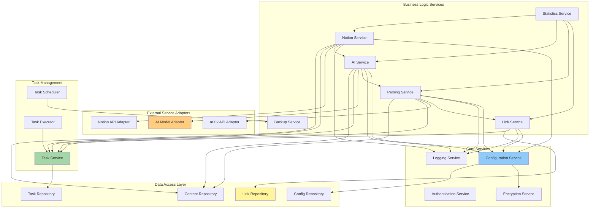
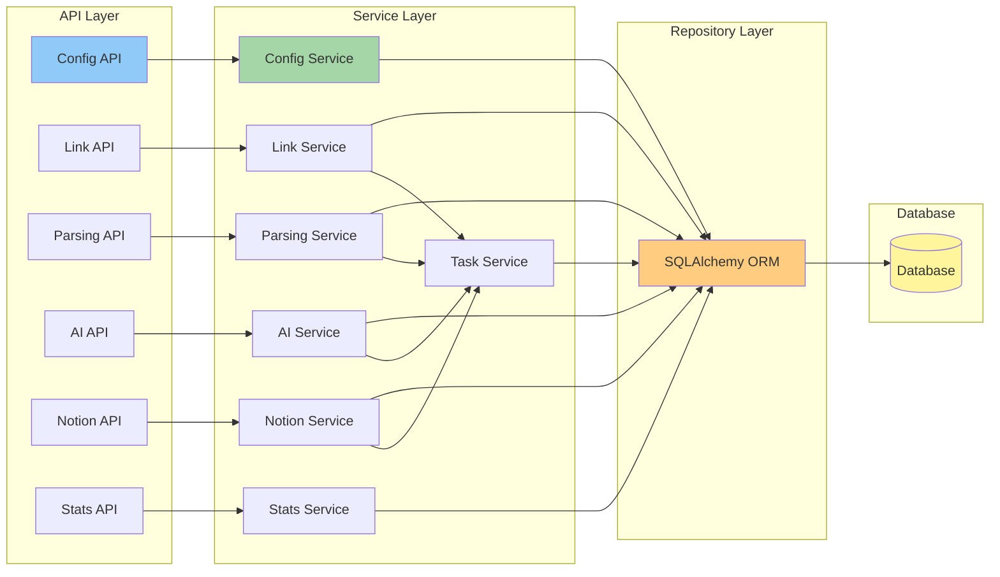
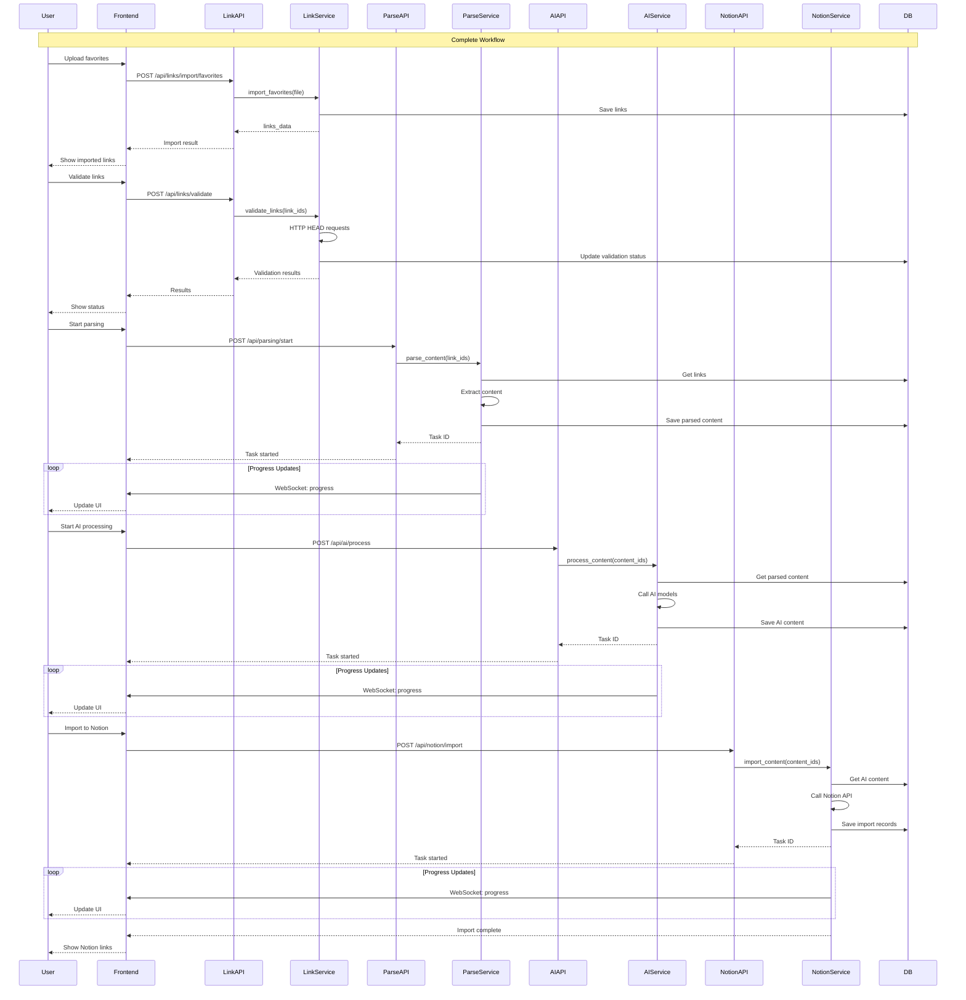
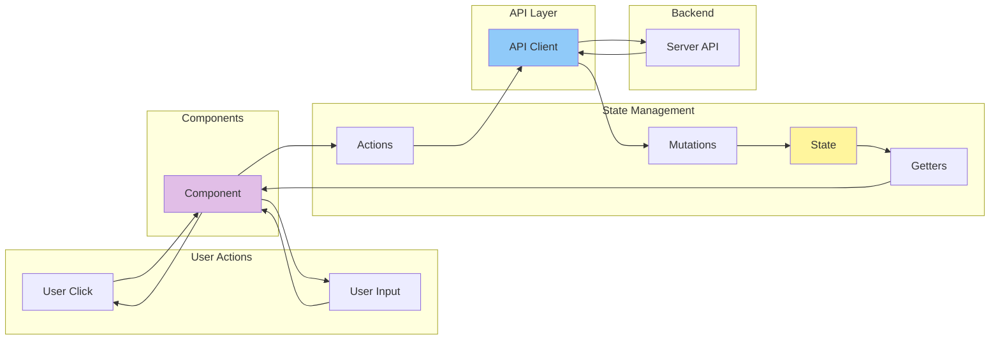
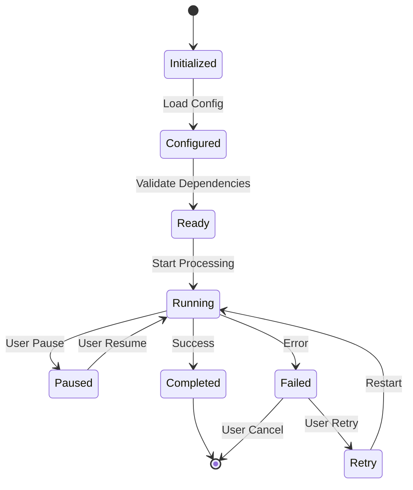
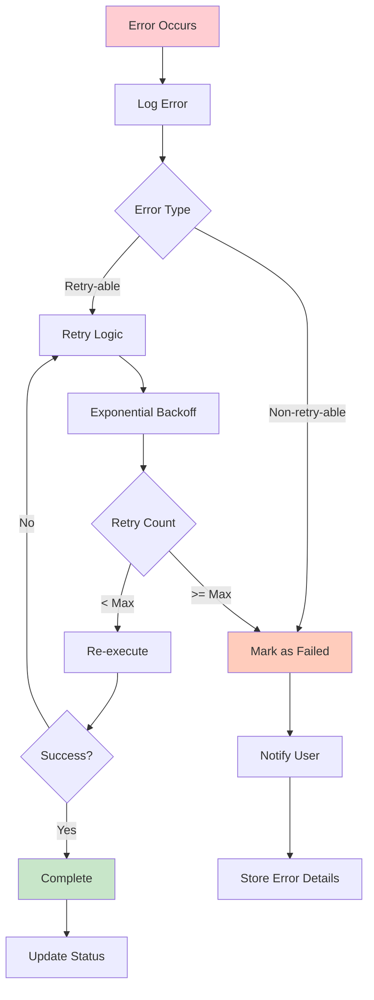

# Module Relationship Diagram

## Backend Service Dependencies



## Frontend Component Hierarchy

```mermaid
graph TB
    subgraph "App Container"
        App[App.vue/jsx]
    end

    subgraph "Layout Components"
        Layout[Main Layout]
        Header[Header]
        Sidebar[Sidebar]
        Footer[Footer]
    end

    subgraph "Page Components"
        ConfigPage[Configuration Page]
        ImportPage[Link Import Page]
        ProcessPage[Processing Page]
        NotionPage[Notion Page]
        DashboardPage[Dashboard Page]
        ManagePage[Management Page]
        TaskPage[Task Page]
    end

    subgraph "Feature Panels"
        ModelPanel[Model Config Panel]
        NotionPanel[Notion Config Panel]
        ParamsPanel[Parameters Panel]

        ImportMethodPanel[Import Method Panel]
        LinkListPanel[Link List Panel]

        ParsingPanel[Parsing Panel]
        AIPanel[AI Processing Panel]

        HierarchyPanel[Hierarchy Panel]
        MappingPanel[Mapping Panel]
        ImportPanel[Import Panel]

        StatsPanel[Statistics Panel]
        ChartsPanel[Charts Panel]

        ContentPanel[Content Panel]
        BackupPanel[Backup Panel]
    end

    subgraph "Shared Components"
        Table[Data Table]
        Form[Form]
        Modal[Modal]
        Toast[Toast]
        Progress[Progress Bar]
        Chart[Chart Component]
    end

    subgraph "State Management"
        Store[Global Store]
        ConfigModule[Config Module]
        LinkModule[Link Module]
        ContentModule[Content Module]
        TaskModule[Task Module]
    end

    App --> Layout
    Layout --> Header
    Layout --> Sidebar
    Layout --> Footer

    Layout --> ConfigPage
    Layout --> ImportPage
    Layout --> ProcessPage
    Layout --> NotionPage
    Layout --> DashboardPage
    Layout --> ManagePage
    Layout --> TaskPage

    ConfigPage --> ModelPanel
    ConfigPage --> NotionPanel
    ConfigPage --> ParamsPanel

    ImportPage --> ImportMethodPanel
    ImportPage --> LinkListPanel

    ProcessPage --> ParsingPanel
    ProcessPage --> AIPanel

    NotionPage --> HierarchyPanel
    NotionPage --> MappingPanel
    NotionPage --> ImportPanel

    DashboardPage --> StatsPanel
    DashboardPage --> ChartsPanel

    ManagePage --> ContentPanel
    ManagePage --> BackupPanel

    ModelPanel --> Form
    LinkListPanel --> Table
    ParsingPanel --> Progress
    ChartsPanel --> Chart

    ConfigPage --> Store
    ImportPage --> Store
    ProcessPage --> Store
    NotionPage --> Store

    Store --> ConfigModule
    Store --> LinkModule
    Store --> ContentModule
    Store --> TaskModule

    style App fill:#e1bee7
    style Store fill:#fff59d
    style Table fill:#c5e1a5
```



## Service Layer Architecture



## Data Flow Between Modules



## Module Dependency Matrix

| Module | Depends On | Used By |
|--------|-----------|---------|
| **Configuration Service** | Encryption Service, Config Repository | All business services |
| **Link Service** | Config Service, Link Repository, Task Service | Parsing Service, Stats Service |
| **Parsing Service** | Config Service, Link Service, Content Repository, arXiv Adapter | AI Service, Stats Service |
| **AI Service** | Config Service, Parsing Service, Content Repository, Model Adapter | Notion Service, Stats Service |
| **Notion Service** | Config Service, AI Service, Content Repository, Notion Adapter | Stats Service |
| **Statistics Service** | All business services | Dashboard, Reports |
| **Task Service** | Task Repository | All async operations |
| **Backup Service** | File System, Database | Scheduler |
| **Encryption Service** | - | Configuration Service |
| **Logging Service** | - | All services |

## Cross-Module Communication Patterns

### 1. Synchronous API Calls

```python
# Direct service-to-service calls
class AIService:
    def __init__(self):
        self.parsing_service = ParsingService()
        self.config_service = ConfigurationService()

    def process_content(self, content_id):
        # Get parsed content
        parsed = self.parsing_service.get_content(content_id)
        # Get model config
        model = self.config_service.get_default_model()
        # Process with AI
        result = self._call_ai_model(parsed, model)
        return result
```

### 2. Asynchronous Task Queue

```python
# Via Task Service
class NotionService:
    def import_content(self, content_ids, mapping_id):
        # Create task
        task = self.task_service.create_task(
            type='notion_import',
            items=content_ids,
            config={'mapping_id': mapping_id}
        )

        # Execute async
        self.task_executor.execute(
            task_id=task.id,
            handler=self._import_handler
        )

        return task
```

### 3. Event-Driven WebSocket

```python
# Emit progress events
class TaskExecutor:
    def execute(self, task_id, handler):
        task = self.task_service.get_task(task_id)

        for item in task.items:
            # Process item
            result = handler(item)

            # Update progress
            task.update_progress()

            # Emit WebSocket event
            socketio.emit('task_progress', {
                'task_id': task_id,
                'progress': task.progress,
                'current_item': item
            })
```

### 4. Repository Pattern

```python
# Data access abstraction
class LinkService:
    def __init__(self):
        self.link_repo = LinkRepository()

    def get_links(self, filters):
        return self.link_repo.find_all(filters)

    def save_link(self, link):
        return self.link_repo.save(link)
```

## Frontend State Flow



## Module Integration Points

### Configuration Module ↔ All Modules

```
ConfigService provides:
- AI model configurations → AI Service
- Notion credentials → Notion Service
- Tool parameters → All services
- Encryption/Decryption → Sensitive data handling
```

### Link Module → Parsing Module

```
Link Service provides:
- Valid link list → Parsing Service
- Link metadata → Content enrichment
- Validation status → Filtering
```

### Parsing Module → AI Module

```
Parsing Service provides:
- Raw content → AI input
- Formatted content → AI context
- Quality score → Processing decision
- Paper info → arXiv integration
```

### AI Module → Notion Module

```
AI Service provides:
- Processed summary → Notion content
- Keywords → Notion tags
- Structured content → Notion blocks
- Version history → Sync comparison
```

### All Modules → Task Module

```
All async operations:
- Create task records
- Update progress
- Track errors
- Emit WebSocket events
```

### All Modules → Statistics Module

```
All operations contribute:
- Success/failure counts
- Time consumption metrics
- Quality scores
- User satisfaction ratings
```

## Service Lifecycle



## Error Handling Flow



## Module Scalability Considerations

### Horizontal Scaling

```
┌─────────────┐     ┌─────────────┐     ┌─────────────┐
│   Web App   │     │   Web App   │     │   Web App   │
│  Instance 1 │     │  Instance 2 │     │  Instance 3 │
└──────┬──────┘     └──────┬──────┘     └──────┬──────┘
       │                   │                   │
       └───────────────────┴───────────────────┘
                           │
                    ┌──────▼──────┐
                    │ Load Balancer│
                    └──────┬──────┘
                           │
       ┌───────────────────┴───────────────────┐
       │                                       │
┌──────▼──────┐                         ┌─────▼──────┐
│  Database   │◄────────────────────────┤   Redis    │
│  (Primary)  │                         │   Cache    │
└─────────────┘                         └────────────┘
```

### Worker Pool Architecture

```
                    ┌──────────────┐
                    │  Task Queue  │
                    └───────┬──────┘
                            │
        ┌───────────────────┼───────────────────┐
        │                   │                   │
┌───────▼────────┐  ┌───────▼────────┐  ┌──────▼─────────┐
│ Parse Worker 1 │  │ Parse Worker 2 │  │ Parse Worker 3 │
└────────────────┘  └────────────────┘  └────────────────┘

        ┌───────────────────┼───────────────────┐
        │                   │                   │
┌───────▼────────┐  ┌───────▼────────┐  ┌──────▼─────────┐
│  AI Worker 1   │  │  AI Worker 2   │  │  AI Worker 3   │
└────────────────┘  └────────────────┘  └────────────────┘

        ┌───────────────────┼───────────────────┐
        │                   │                   │
┌───────▼────────┐  ┌───────▼────────┐  ┌──────▼─────────┐
│Notion Worker 1 │  │Notion Worker 2 │  │Notion Worker 3 │
└────────────────┘  └────────────────┘  └────────────────┘
```

## Module Testing Strategy

| Module Type | Test Approach | Tools |
|-------------|---------------|-------|
| **Services** | Unit tests with mocked dependencies | pytest, unittest.mock |
| **APIs** | Integration tests with test client | pytest-flask |
| **Repositories** | Database integration tests | pytest-sqlalchemy |
| **External Adapters** | Mocked external API responses | responses, VCR.py |
| **Task Execution** | Async task testing | pytest-asyncio |
| **Frontend Components** | Component unit tests | Jest, React Testing Library |
| **Frontend Integration** | E2E tests | Cypress, Playwright |
| **State Management** | State mutation tests | Jest |

## Module Development Order

### Phase 1: Foundation
1. Database models and migrations
2. Configuration service
3. Encryption service
4. Logging service
5. Repository layer

### Phase 2: Core Features
6. Link service
7. Parsing service
8. AI service
9. Task service

### Phase 3: Integration
10. Notion service
11. Statistics service
12. Backup service

### Phase 4: Frontend
13. Layout and routing
14. Configuration pages
15. Link import pages
16. Processing pages
17. Notion pages
18. Dashboard and management

### Phase 5: Polish
19. WebSocket integration
20. Error handling
21. Testing
22. Documentation
