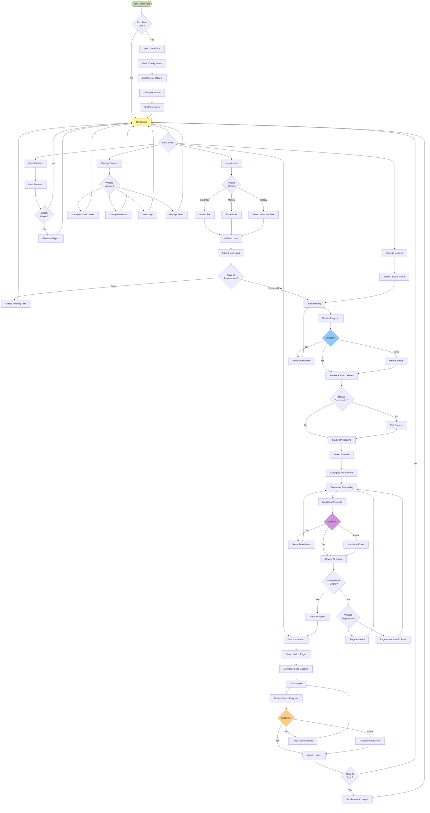
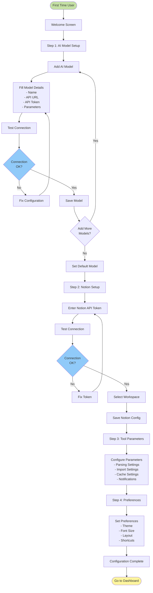
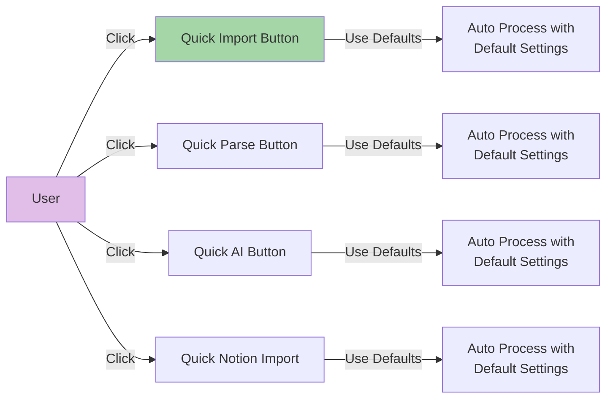
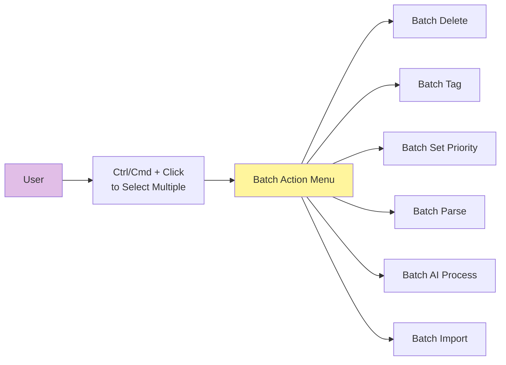
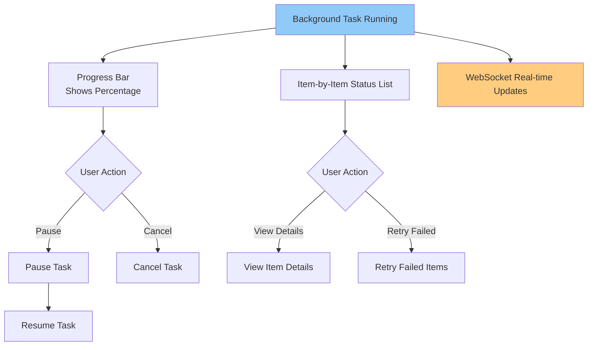
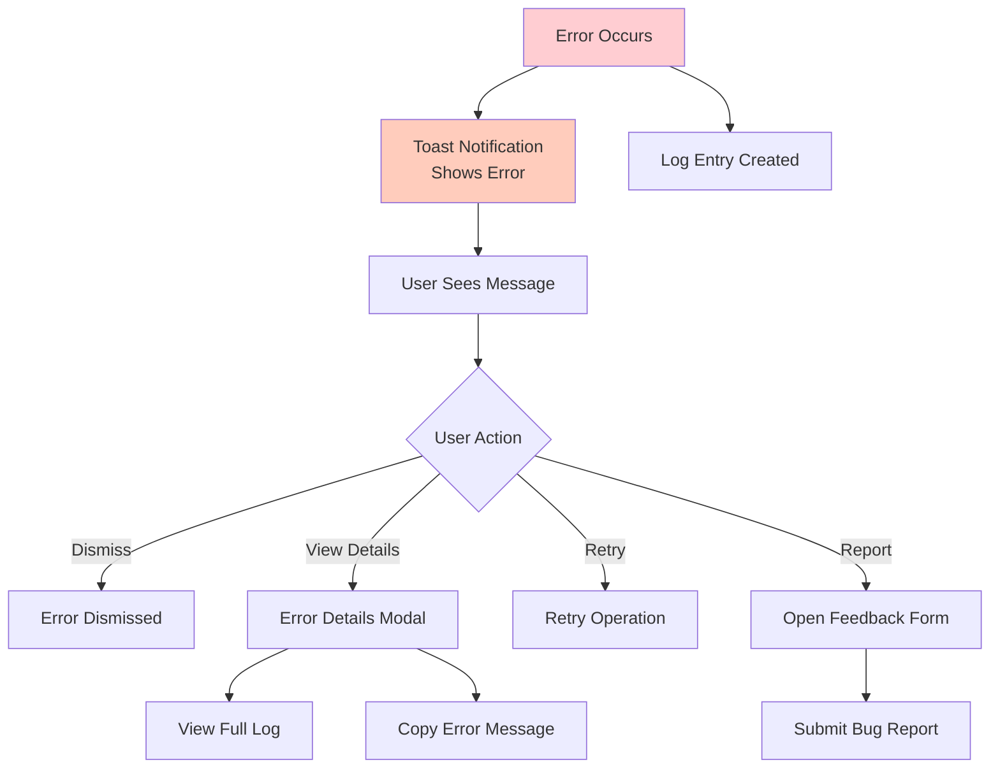
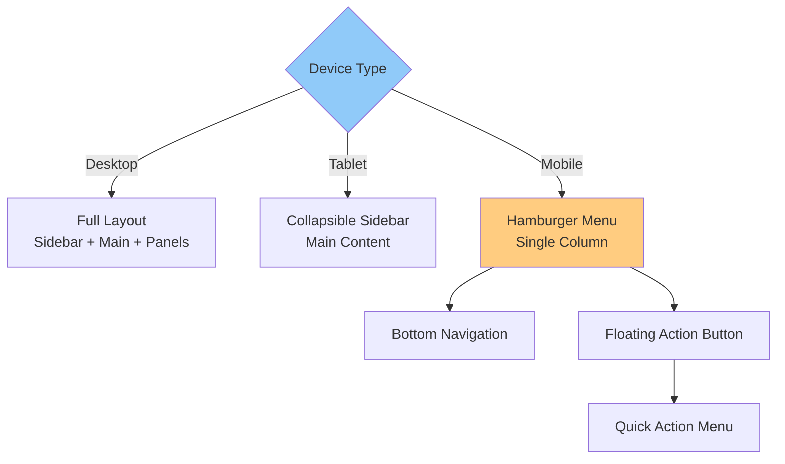
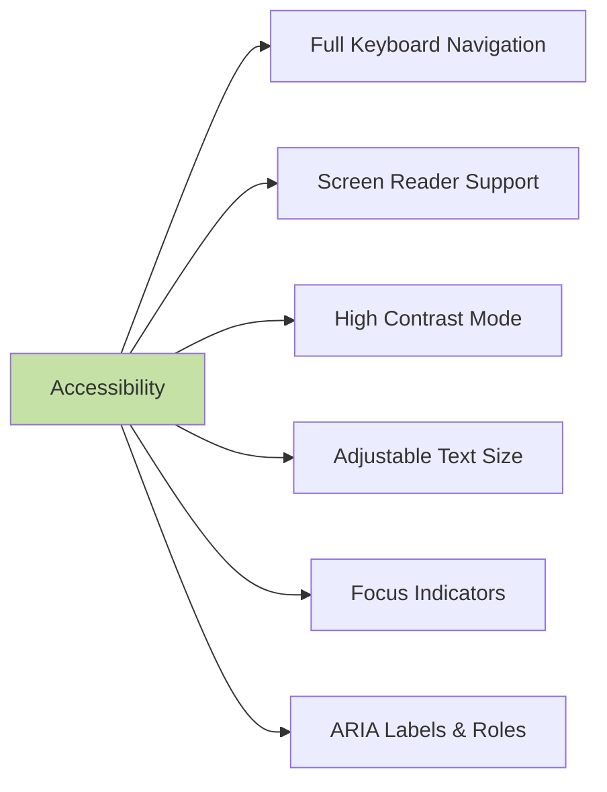

# User Flow Diagrams

## Overall User Journey



## Detailed Flow: Configuration Setup



## Detailed Flow: Link Import Process

```mermaid
graph TB
    Start([Import Links])

    Start --> ChooseMethod{Import Method}

    ChooseMethod -->|Favorites| DropZone[Drag & Drop or<br/>Click to Select File]
    ChooseMethod -->|Manual| TextArea[Paste Links<br/>One per Line]
    ChooseMethod -->|History| HistoryList[Select from<br/>Historical Imports]

    DropZone --> ParseFile[Parse Bookmark File]
    ParseFile --> ExtractLinks[Extract Links &<br/>Metadata]

    TextArea --> ParseText[Parse Text Input]
    ParseText --> ExtractLinks

    HistoryList --> LoadHistory[Load Historical Links]
    LoadHistory --> IncrementalChoice{Full or<br/>Incremental?}

    IncrementalChoice -->|Full| ExtractLinks
    IncrementalChoice -->|Incremental| OnlyNew[Load Only New Links]

    OnlyNew --> ExtractLinks

    ExtractLinks --> Dedup[Deduplicate Links]

    Dedup --> DedupStrategy{Dedup<br/>Strategy}

    DedupStrategy -->|Keep First| KeepFirst[Keep First Occurrence]
    DedupStrategy -->|Keep Latest| KeepLatest[Keep Latest Occurrence]
    DedupStrategy -->|Manual| UserSelect[User Selects]

    KeepFirst --> ShowLinks
    KeepLatest --> ShowLinks
    UserSelect --> ShowLinks

    ShowLinks[Display Link List]

    ShowLinks --> Validate{Validate<br/>Now?}

    Validate -->|Yes| BatchValidate[Start Batch Validation]
    Validate -->|No| FilterSort

    BatchValidate --> ValidationProgress[Show Validation Progress]
    ValidationProgress --> ValidationComplete[Validation Complete]
    ValidationComplete --> MarkStatus[Mark Link Status<br/>✓ Valid<br/>✗ Invalid<br/>⚠ Restricted]

    MarkStatus --> FilterSort

    FilterSort[Filter & Sort Links]

    FilterSort --> FilterOptions{Apply<br/>Filters?}

    FilterOptions -->|Yes| ApplyFilters[Filter by:<br/>- Type<br/>- Status<br/>- Priority<br/>- Tags]
    FilterOptions -->|No| BatchOps

    ApplyFilters --> SortOptions{Sort?}

    SortOptions -->|Yes| ApplySort[Sort by:<br/>- Title<br/>- Date<br/>- Status]
    SortOptions -->|No| BatchOps

    ApplySort --> BatchOps

    BatchOps[Batch Operations]

    BatchOps --> BatchChoice{Batch<br/>Action?}

    BatchChoice -->|Delete| DeleteInvalid[Delete Invalid Links]
    BatchChoice -->|Priority| SetPriority[Set Priority Level]
    BatchChoice -->|Tags| AddTags[Add Tags]
    BatchChoice -->|None| ConfigTask

    DeleteInvalid --> ConfigTask
    SetPriority --> ConfigTask
    AddTags --> ConfigTask

    ConfigTask[Configure Task]

    ConfigTask --> TaskName[Enter Task Name]
    TaskName --> SelectScope{Processing<br/>Scope}

    SelectScope -->|All Valid| AllValid[Include All Valid Links]
    SelectScope -->|Checked| OnlyChecked[Include Only Checked]
    SelectScope -->|Filtered| OnlyFiltered[Include Filtered Results]

    AllValid --> SaveOrStart
    OnlyChecked --> SaveOrStart
    OnlyFiltered --> SaveOrStart

    SaveOrStart{Action}

    SaveOrStart -->|Save for Later| SaveTask[Save as Pending Task]
    SaveOrStart -->|Start Now| StartProcessing[Start Processing Immediately]

    SaveTask --> Success([Task Saved])
    StartProcessing --> ParsingFlow([Go to Parsing Flow])

    style Start fill:#c5e1a5
    style Success fill:#fff59d
    style ParsingFlow fill:#90caf9
```



## Detailed Flow: Content Parsing & AI Processing

```mermaid
graph TB
    Start([Start Processing])

    Start --> SelectContent[Select Links to Parse]
    SelectContent --> ConfigParsing[Configure Parsing<br/>- Thread Count<br/>- Quality Threshold<br/>- Enable OCR]

    ConfigParsing --> StartParse[Start Parsing]

    StartParse --> ParsingQueue[Add to Parsing Queue]
    ParsingQueue --> ParseWorker{Worker Available?}

    ParseWorker -->|No| Wait[Wait in Queue]
    Wait --> ParseWorker

    ParseWorker -->|Yes| DetectType{Content Type?}

    DetectType -->|HTML| ParseHTML[Parse HTML<br/>- Extract Main Content<br/>- Remove Ads/Nav<br/>- Extract Images]
    DetectType -->|PDF| ParsePDF[Parse PDF<br/>- Extract Text<br/>- Handle Encryption<br/>- Extract Metadata]

    ParsePDF --> NeedOCR{Need OCR?}

    NeedOCR -->|Yes| RunOCR[Run OCR<br/>- Detect Language<br/>- Preprocess Images<br/>- Extract Text]
    NeedOCR -->|No| CalcQuality

    ParseHTML --> ExtractPaper{Paper Info<br/>Detected?}

    ExtractPaper -->|Yes| SearchArxiv[Search arXiv API]
    ExtractPaper -->|No| CalcQuality

    SearchArxiv --> ArxivFound{Found on<br/>arXiv?}

    ArxivFound -->|Yes| DownloadPDF[Download Latest PDF]
    ArxivFound -->|No| CalcQuality

    DownloadPDF --> ParseArxivPDF[Parse arXiv PDF]
    ParseArxivPDF --> CalcQuality

    RunOCR --> CalcQuality

    CalcQuality[Calculate Quality Score]

    CalcQuality --> ScoreCheck{Score >=<br/>Threshold?}

    ScoreCheck -->|No| MarkOptimize[Mark for<br/>Manual Optimization]
    ScoreCheck -->|Yes| SaveParsed

    MarkOptimize --> SaveParsed

    SaveParsed[Save Parsed Content]

    SaveParsed --> UpdateProgress[Update Progress]
    UpdateProgress --> MoreItems{More Items<br/>to Parse?}

    MoreItems -->|Yes| ParseWorker
    MoreItems -->|No| ParsingComplete[Parsing Complete]

    ParsingComplete --> ReviewResults[Review Parsing Results]

    ReviewResults --> CheckQuality{Low Quality<br/>Items?}

    CheckQuality -->|Yes| OptimizeManually[Manually Optimize<br/>- Edit Content<br/>- Remove Redundancy<br/>- Fix Formatting]
    CheckQuality -->|No| ReadyForAI

    OptimizeManually --> ReadyForAI

    ReadyForAI[Ready for AI Processing]

    ReadyForAI --> SelectModel[Select AI Model]
    SelectModel --> ConfigAI[Configure AI Processing]

    ConfigAI --> SelectFunctions[Select Functions:<br/>☐ Overall Summary<br/>☐ Chapter Summaries<br/>☐ Structured Content<br/>☐ Keywords<br/>☐ Secondary Content<br/>☐ Insights]

    SelectFunctions --> SetParams[Set Parameters:<br/>- Temperature<br/>- Summary Length<br/>- Structure Framework]

    SetParams --> StartAI[Start AI Processing]

    StartAI --> AIQueue[Add to AI Queue]
    AIQueue --> AIWorker{Worker &<br/>Rate Limit OK?}

    AIWorker -->|No| WaitAI[Wait for Availability]
    WaitAI --> AIWorker

    AIWorker -->|Yes| CallModel[Call AI Model API]

    CallModel --> ModelResponse{Response OK?}

    ModelResponse -->|Timeout| RetryLogic[Retry with<br/>Exponential Backoff]
    ModelResponse -->|Error| LogError[Log Error]
    ModelResponse -->|Success| ProcessResponse[Process Response]

    RetryLogic --> RetryCount{Retry Count<br/>< Max?}

    RetryCount -->|Yes| CallModel
    RetryCount -->|No| LogError

    LogError --> MarkFailed[Mark as Failed]
    MarkFailed --> UpdateAIProgress

    ProcessResponse --> ExtractOutputs[Extract Outputs<br/>- Summary<br/>- Keywords<br/>- Structured Content<br/>etc.]

    ExtractOutputs --> SaveAI[Save AI Content<br/>with Version Number]

    SaveAI --> TrackCost[Track Tokens & Cost]
    TrackCost --> UpdateAIProgress[Update Progress]

    UpdateAIProgress --> MoreAI{More Items<br/>to Process?}

    MoreAI -->|Yes| AIWorker
    MoreAI -->|No| AIComplete[AI Processing Complete]

    AIComplete --> ReviewAI[Review AI Outputs]

    ReviewAI --> CheckSatisfaction{Satisfied with<br/>Results?}

    CheckSatisfaction -->|No| RegenerateWhat{What to<br/>Regenerate?}

    RegenerateWhat -->|Summary| RegenSummary[Regenerate Summary<br/>with Instructions]
    RegenerateWhat -->|Keywords| RegenKeywords[Regenerate Keywords]
    RegenerateWhat -->|All| RegenAll[Regenerate All]

    RegenSummary --> CallModel
    RegenKeywords --> CallModel
    RegenAll --> CallModel

    CheckSatisfaction -->|Yes| ManualEdit{Need Manual<br/>Edits?}

    ManualEdit -->|Yes| EditAI[Edit AI Content<br/>- Refine Summary<br/>- Add/Remove Keywords<br/>- Adjust Structure]
    ManualEdit -->|No| MarkReady

    EditAI --> SaveVersion[Save as New Version]
    SaveVersion --> MarkReady

    MarkReady[Mark for Notion Import]

    MarkReady --> Complete([Processing Complete])

    style Start fill:#c5e1a5
    style Complete fill:#fff59d
    style ModelResponse fill:#90caf9
    style CheckSatisfaction fill:#ce93d8
```



## Detailed Flow: Notion Import

```mermaid
graph TB
    Start([Import to Notion])

    Start --> SelectContent[Select Content to Import]
    SelectContent --> TargetChoice{Use Existing<br/>Mapping?}

    TargetChoice -->|Yes| LoadMapping[Load Saved Mapping]
    TargetChoice -->|No| NewMapping[Create New Mapping]

    NewMapping --> BrowseHierarchy[Browse Notion Hierarchy]
    BrowseHierarchy --> HierarchyView[Tree View of Pages]

    HierarchyView --> SearchPage{Search<br/>Page?}

    SearchPage -->|Yes| SearchInput[Enter Search Term]
    SearchInput --> FilterTree[Filter Tree Results]
    FilterTree --> SelectTarget

    SearchPage -->|No| SelectTarget

    SelectTarget[Select Target Location]

    SelectTarget --> TargetExists{Target<br/>Exists?}

    TargetExists -->|No| CreateNew[Create New Page/Database]
    TargetExists -->|Yes| ConfigureFields

    CreateNew --> NewPageForm[Enter Page Details<br/>- Title<br/>- Type (Page/Database)<br/>- Parent]
    NewPageForm --> CreateNotionPage[Call Notion API<br/>Create Page]
    CreateNotionPage --> CreateSuccess{Success?}

    CreateSuccess -->|No| ShowError[Show Error Message]
    ShowError --> NewPageForm

    CreateSuccess -->|Yes| RefreshHierarchy[Refresh Hierarchy]
    RefreshHierarchy --> ConfigureFields

    LoadMapping --> ConfigureFields

    ConfigureFields[Configure Field Mapping]

    ConfigureFields --> MapSummary[Map: Summary → Abstract]
    MapSummary --> MapKeywords[Map: Keywords → Tags]
    MapKeywords --> MapContent[Map: Content → Body]
    MapContent --> MapSource[Map: Source URL → Link]
    MapSource --> MapCustom{Custom<br/>Fields?}

    MapCustom -->|Yes| AddCustom[Add Custom Field Mappings]
    MapCustom -->|No| FormatSettings

    AddCustom --> FormatSettings

    FormatSettings[Configure Format Settings]

    FormatSettings --> ImageSetting[Image Mode:<br/>○ Upload to Notion<br/>○ Keep URL]
    ImageSetting --> CodeSetting[Code Block Format:<br/>○ Notion Code Block<br/>○ Plain Text]
    CodeSetting --> ListSetting[List Format:<br/>○ Preserve Original<br/>○ Convert to Paragraphs]

    ListSetting --> SaveMapping{Save<br/>Mapping?}

    SaveMapping -->|Yes| SaveTemplate[Save as Template]
    SaveMapping -->|No| ImportMode

    SaveTemplate --> MappingName[Enter Mapping Name]
    MappingName --> StoreMapping[Store Mapping Config]
    StoreMapping --> ImportMode

    ImportMode[Select Import Mode]

    ImportMode --> ModeChoice{Mode}

    ModeChoice -->|Batch| BatchConfig[Configure Batch:<br/>- Concurrency: 3<br/>- Rate Limit Handling]
    ModeChoice -->|Single| SingleConfig[Import One by One]
    ModeChoice -->|Scheduled| ScheduleConfig[Schedule Import:<br/>- Date & Time<br/>- Recurrence]

    BatchConfig --> StartImport
    SingleConfig --> StartImport
    ScheduleConfig --> SaveSchedule[Save Scheduled Task]

    SaveSchedule --> Scheduled([Task Scheduled])

    StartImport[Start Import]

    StartImport --> ImportQueue[Add to Import Queue]
    ImportQueue --> ImportWorker{Worker &<br/>Rate Limit OK?}

    ImportWorker -->|No| WaitImport[Wait]
    WaitImport --> ImportWorker

    ImportWorker -->|Yes| ConvertBlocks[Convert to Notion Blocks]

    ConvertBlocks --> BlockTypes[Handle Block Types:<br/>- Headings<br/>- Paragraphs<br/>- Lists<br/>- Code<br/>- Images<br/>- Tables]

    BlockTypes --> CallNotionAPI[Call Notion API<br/>Create Page]

    CallNotionAPI --> NotionResponse{Response OK?}

    NotionResponse -->|Permission Error| ShowPermError[Show Permission Error]
    NotionResponse -->|Rate Limited| WaitRetry[Wait & Retry]
    NotionResponse -->|Other Error| LogImportError[Log Error]
    NotionResponse -->|Success| SaveImportRecord

    ShowPermError --> MarkImportFailed
    WaitRetry --> CallNotionAPI
    LogImportError --> MarkImportFailed

    MarkImportFailed[Mark as Failed]
    MarkImportFailed --> UpdateImportProgress

    SaveImportRecord[Save Import Record<br/>- Notion Page ID<br/>- Notion URL<br/>- Timestamp]

    SaveImportRecord --> UpdateImportProgress[Update Progress]

    UpdateImportProgress --> MoreToImport{More Items?}

    MoreToImport -->|Yes| ImportWorker
    MoreToImport -->|No| ImportComplete[Import Complete]

    ImportComplete --> ReviewImport[Review Import Results]

    ReviewImport --> FailedItems{Failed<br/>Items?}

    FailedItems -->|Yes| RetryChoice{Retry<br/>Failed?}
    FailedItems -->|No| ViewResults

    RetryChoice -->|Yes| RetryFailed[Retry Failed Items]
    RetryChoice -->|No| ViewResults

    RetryFailed --> StartImport

    ViewResults[View Import Results]

    ViewResults --> JumpToNotion[Click to Jump to Notion]
    JumpToNotion --> OpenNotion[Open Notion Page<br/>in New Tab]

    OpenNotion --> SyncNeeded{Need<br/>Sync?}

    SyncNeeded -->|Yes| SyncFlow([Go to Sync Flow])
    SyncNeeded -->|No| Complete([Import Complete])

    style Start fill:#c5e1a5
    style Complete fill:#fff59d
    style Scheduled fill:#fff59d
    style NotionResponse fill:#90caf9
```

## User Interaction Patterns

### 1. Quick Actions



### 2. Batch Operations



### 3. Progress Monitoring



### 4. Error Handling



### 5. Keyboard Shortcuts

```
Common Shortcuts:
- Ctrl/Cmd + I: Import Links
- Ctrl/Cmd + P: Start Parsing
- Ctrl/Cmd + A: AI Processing
- Ctrl/Cmd + N: Import to Notion
- Ctrl/Cmd + S: Save Current State
- Ctrl/Cmd + F: Search/Filter
- Ctrl/Cmd + /: Show Shortcuts Help
- Esc: Close Modal/Cancel Action
- Space: Pause/Resume Task
```

## Mobile Responsiveness Flow



## Accessibility Features



## User Feedback Collection Points

```mermaid
graph TB
    Feedback[Feedback Collection]

    Feedback --> AfterAI[After AI Processing<br/>"Rate AI Output"]
    Feedback --> AfterImport[After Notion Import<br/>"Import Satisfaction"]
    Feedback --> ErrorOccurs[When Error Occurs<br/>"Report Issue"]
    Feedback --> MenuOption[Help Menu<br/>"Send Feedback"]

    AfterAI --> Rating1[1-5 Star Rating]
    AfterImport --> Rating2[1-5 Star Rating]
    ErrorOccurs --> BugReport[Bug Report Form]
    MenuOption --> GeneralFeedback[General Feedback Form]

    Rating1 --> Optional1[Optional Comment]
    Rating2 --> Optional2[Optional Comment]

    style Feedback fill:#fff59d
```

This completes the user flow diagrams showing the complete journey from initial setup through all major features of the Notion KB Manager!
